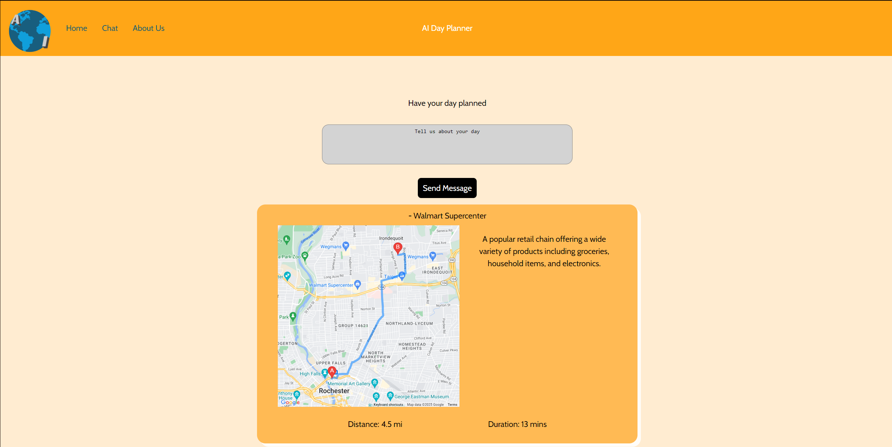

# BrickHack 11 AItinerary Project

We put together a website that utilizes OpenAI GPT-4o-mini to suggest places to visit based on the criteria you enter. You are then given a list of locations, with directions between each and a brief description.

This site is build in React, with a backend running on Java Spring with the latest Spring-AI functionality to communicate with the OpenAI API.
